# RAG Personalized Agentic Tutor

A personalized AI tutoring platform built on a multi-stage RAG pipeline. The system ingests course materials (textbooks, lecture slides, scans, handwritten notes), performs hybrid retrieval with reranking, and generates Socratic-style answers with inline citations -- all served through a streaming chat interface.

The platform is demonstrated with two sample courses -- **RAG** (Retrieval-Augmented Generation) and **ML** (Machine Learning) -- each with textbook and lecture slide and handwritten materials. The course data cannot be published due to licensing, but the evaluation results are included in this repository.

## Table of Contents

- [Features](#features)
- [Architecture](#architecture)
- [Tech Stack](#tech-stack)
- [Demo](#demo)
- [Getting Started](#getting-started)
- [Usage](#usage)
- [Evaluation](#evaluation)
- [API Reference](#api-reference)
- [Project Structure](#project-structure)
- [Roadmap](#roadmap)

## Features

### Document Ingestion

- **Multi-format support**: PDF textbooks (via Docling), lecture slides (PyMuPDF + Gemini Vision fallback), printed scans (Surya OCR), handwritten notes (Gemini Vision), and Markdown
- **Intelligent chunking**: Format-aware strategies -- hybrid chunking for textbooks (1024 tokens), one-chunk-per-slide for slides, header-aware splitting for Markdown, recursive splitting for student notes (512 tokens)
- **LLM-enriched metadata**: Gemini Flash extracts `content_category` and `topic_tags` per chunk for fine-grained filtering
- **Dual embeddings**: Dense (Qwen3-Embedding-8B, 1024-dim) + sparse (BM25 via fastembed) stored in Qdrant named vectors
- **Duplicate detection**: File-hash-based deduplication prevents re-ingestion
- **Background processing**: Upload returns immediately with a job ID; progress is polled via API (loading -> chunking -> enriching -> embedding -> complete)

### Retrieval and Generation

- **Hybrid search**: Qdrant-native Reciprocal Rank Fusion across dense and BM25 vectors -- critical for exact STEM terms like `O(log n)` or `Dijkstra`
- **Query preprocessing**: Gemini Flash rewrites and expands queries, classifies intent, and applies guardrails for out-of-scope questions
- **Cross-modal reranking**: jina-reranker-v3 re-scores candidates after deduplication
- **Context assembly**: Numbered citations with source filename, page number, section header, and relevance score
- **Three answer modes**: Long (detailed explanation), Short (concise answer), ELI5 (simplified)
- **Streaming responses**: Server-Sent Events via FastAPI with Gemini 2.5 Flash async generation
- **Session management**: In-memory sessions with 24-hour TTL and configurable history depth

### Chat Interface

- **Streamlit-based UI** with Google Sign-In authentication
- **Role-based access**: Lecturers upload to `course_content`; students upload to private `student_notes`
- **Live streaming** with expandable citation cards showing source text previews
- **Pipeline stats panel**: Timing breakdown (preprocessing, retrieval, reranking, generation) and candidate counts
- **Metadata filters**: Filter by course, module week, module name, uploader, or source file

### Offline Evaluation

- **RAGAS v0.4 framework** with two-stage design for memory-constrained environments
- **Stage 1**: Retrieval + generation (loads `Qwen3-Embedding-8B` embeddings + `jina-reranker`, saves intermediate JSON, exits to free GPU)
- **Stage 2**: RAGAS scoring + output accuracy (loads only lightweight `nomic` embeddings + local `Qwen3-8B` evaluator)
- **Metrics**: Faithfulness, answer relevancy, context precision, context recall, and custom LLM-judged output accuracy
- **Curated datasets**: 72 single-turn + 10 multi-turn scenarios (28 turns) across 2 demo courses Rand cross-course domains, plus 91 QASPER benchmark Q&A pairs from 20 NLP papers
- **JSON reports** with per-sample scores, aggregate statistics, and latency breakdown

## Architecture

### Ingestion Pipeline

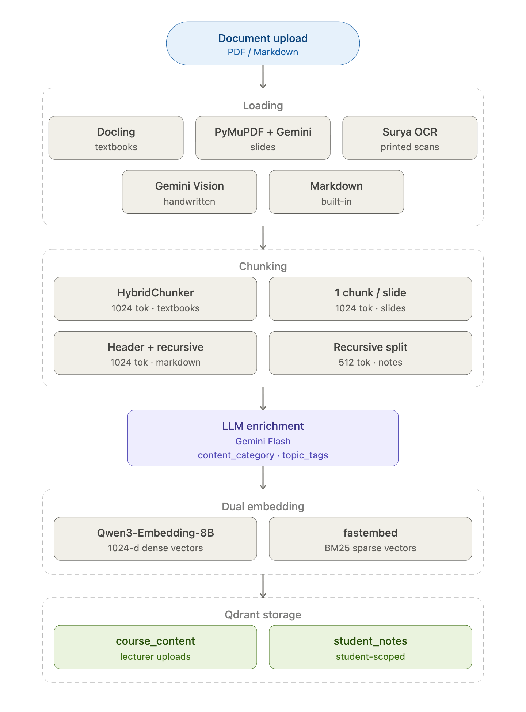

### Retrieval and Generation Pipeline

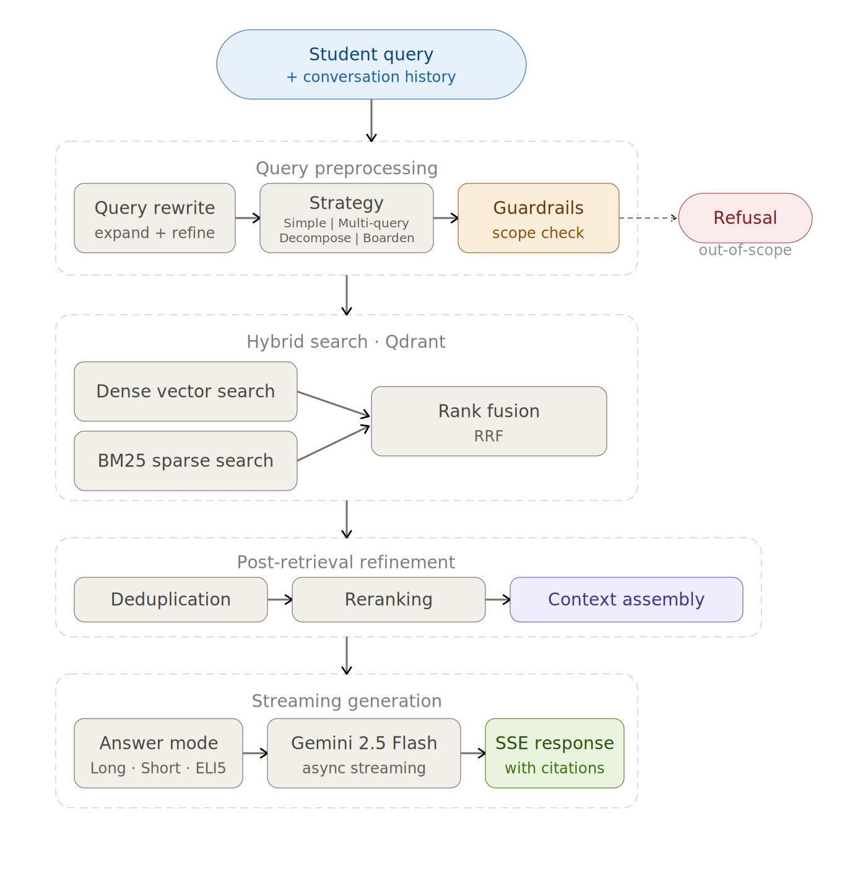

### Evaluation Pipeline

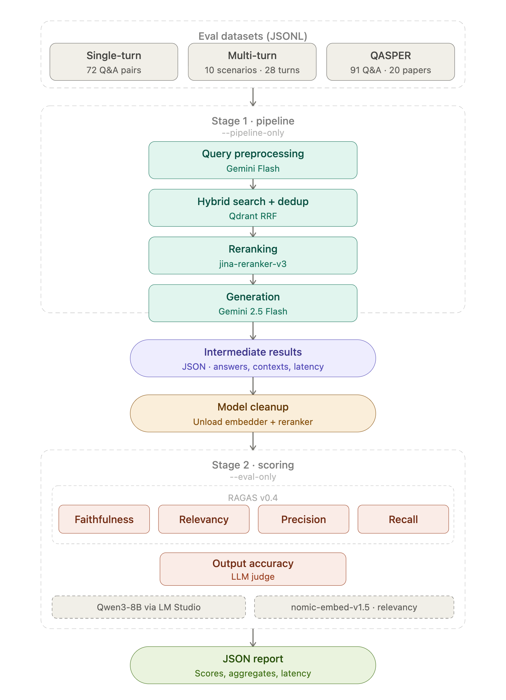

## Tech Stack

| Layer | Technology |
|---|---|
| Backend | FastAPI |
| Frontend | Streamlit |
| Vector DB | Qdrant (dense + BM25 named vectors) |
| Dense Embeddings | Qwen3-Embedding-8B (sentence-transformers) |
| Sparse Embeddings | BM25 (fastembed) |
| Reranker | jina-reranker-v3 (transformers) |
| Generation LLM | Google Gemini 2.5 Flash |
| Query Preprocessing | Google Gemini Flash |
| Document Loading | Docling, PyMuPDF, Surya OCR, Gemini Vision |
| Evaluation | RAGAS v0.4, LM Studio (Qwen3-8B) |

## Demo

### Authentication

Google Sign-In with role-based access (lecturer vs. student):

| Sign In | Lecturer View | Student View |
|---|---|---|
| 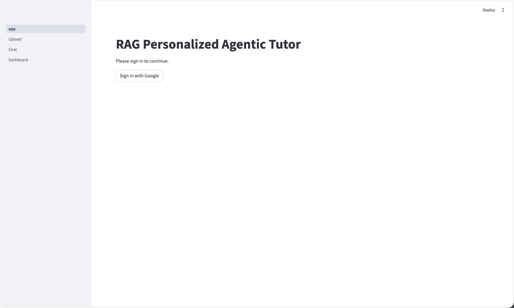 | 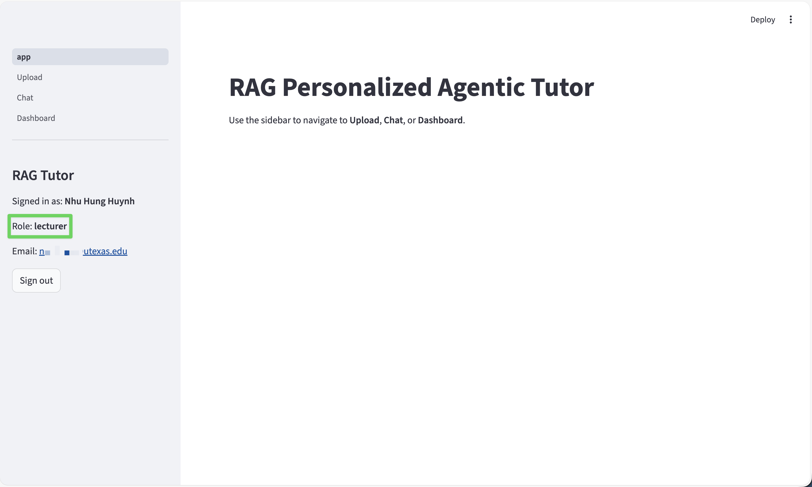 | 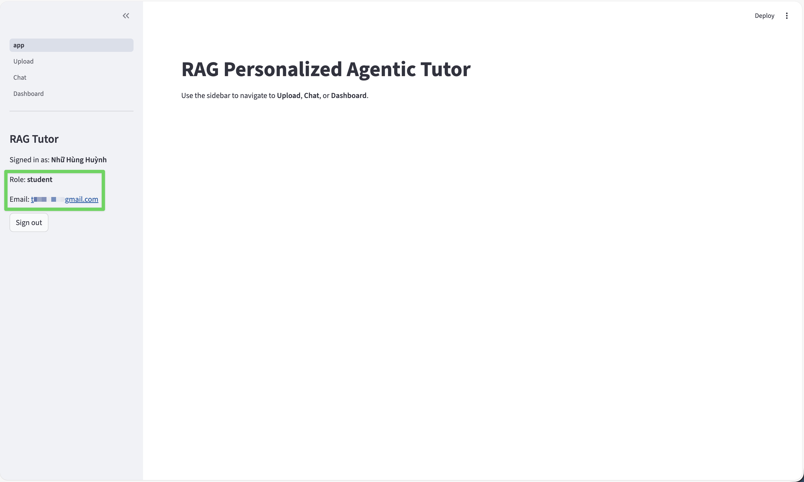 |

### Upload Interface

Document type selection and metadata filters:

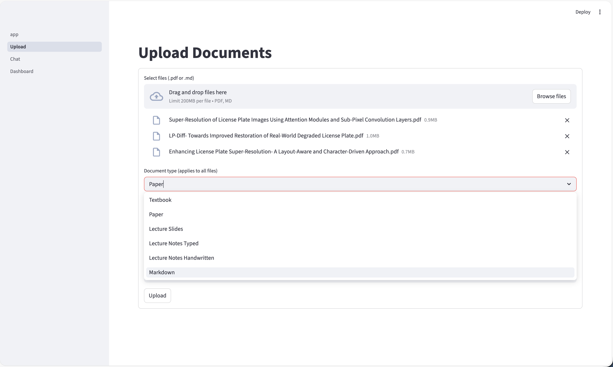

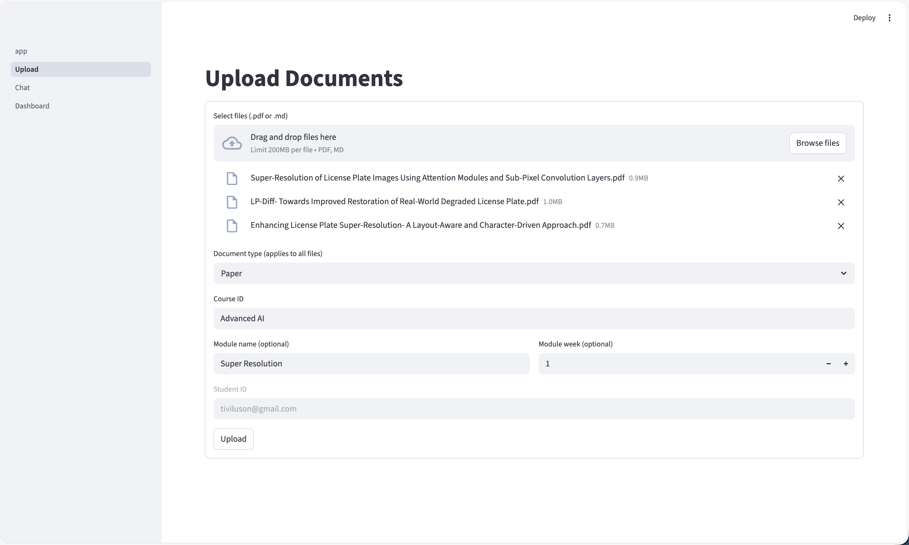

Real-time progress tracking per file (loading, chunking, enriching, embedding):

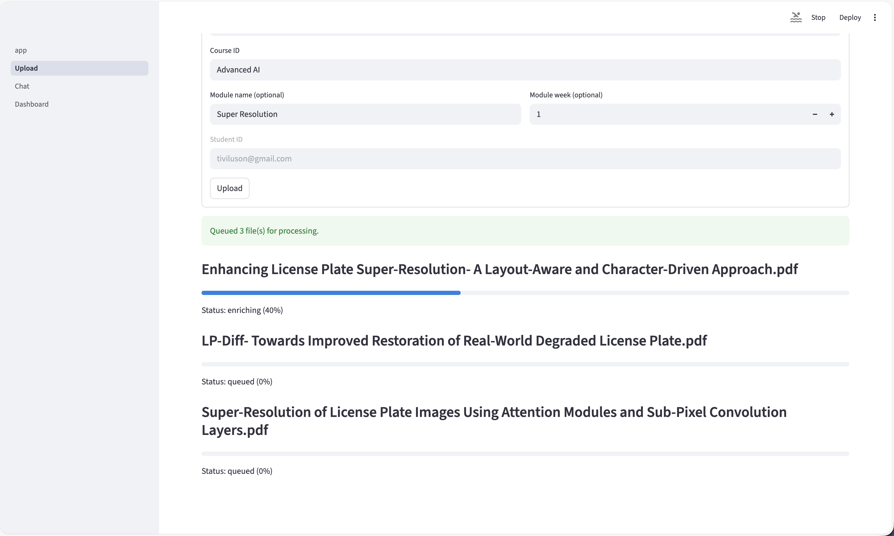

### Chat Interface

Streaming response with numbered inline citations:

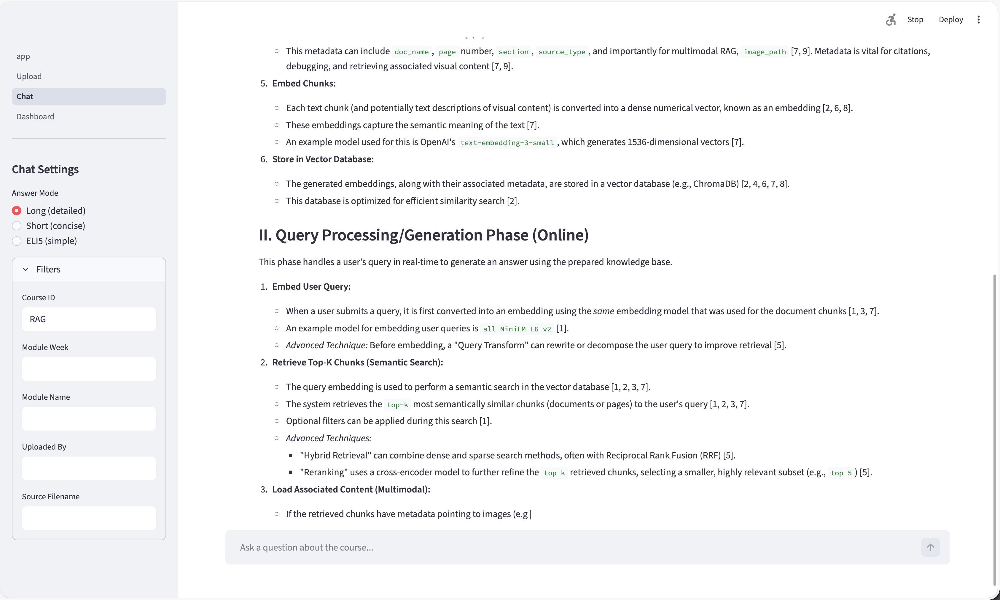

Expandable citation cards with source metadata and text previews:

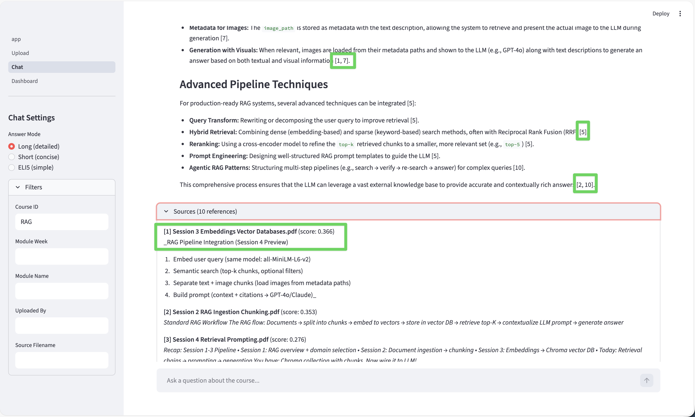

Pipeline stats panel showing retrieval strategy, candidate counts, and per-stage latency:

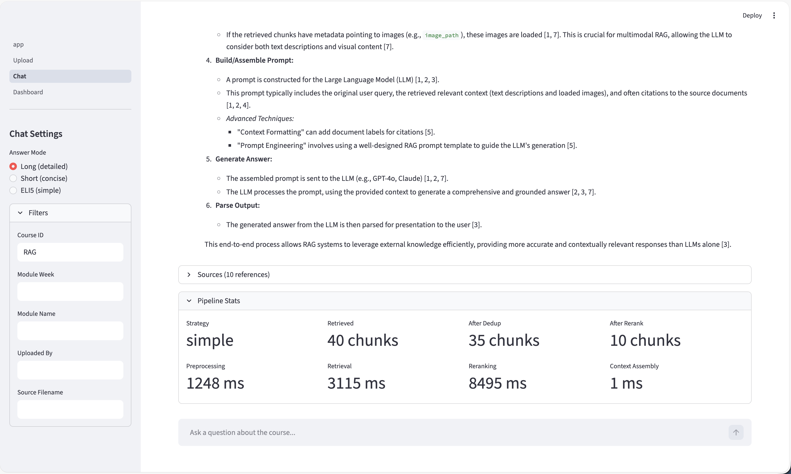

Out-of-scope guardrails (no retrieval performed):

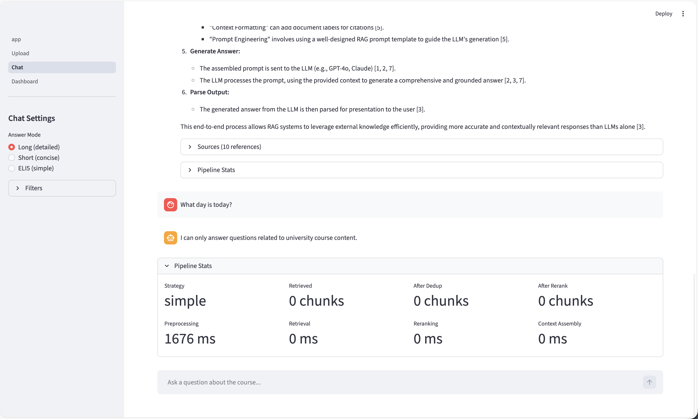

ELI5 answer mode for simplified explanations:

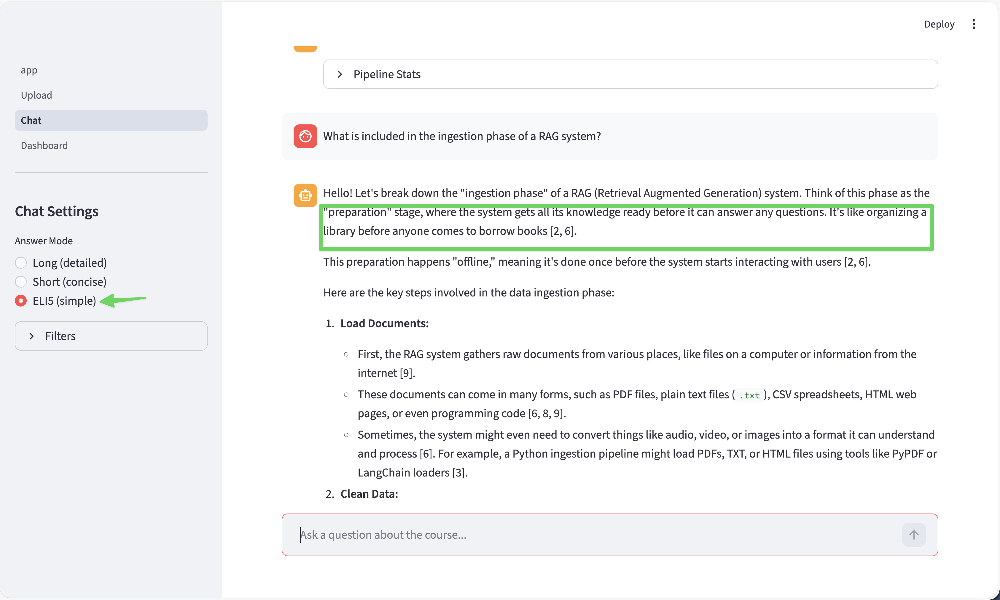

### Dashboard

Collection statistics for course content and student notes:


Qdrant point detail showing payload metadata and dual vectors (BM25 + dense):

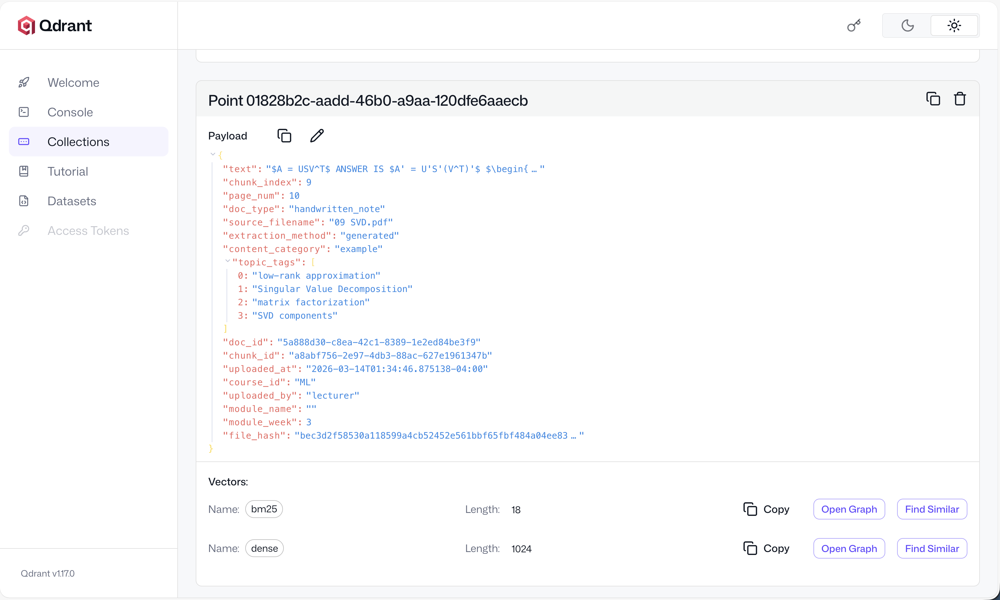

## Getting Started

### Prerequisites

- Python 3.11+
- [Conda](https://docs.conda.io/)
- [Qdrant](https://qdrant.tech/) (local or Docker)
- Google Gemini API key

### Installation

```bash
# Clone the repository
git clone https://github.com/tiviluson/RAG_Personalized_Agentic_Tutor.git
cd RAG_Personalized_Agentic_Tutor

# Create and activate conda environment
conda create -n rag python=3.11 -y
conda activate rag

# Install dependencies
uv pip install -e .
```

### Configuration

Create a `.env` file in the project root:

```env
# Required
GEMINI_API_KEY=your_gemini_api_key

# Qdrant (defaults shown)
QDRANT_HOST=localhost
QDRANT_PORT=6333

# Optional: Evaluation
EVAL_LLM_BASE_URL=http://127.0.0.1:1234/v1
EVAL_LLM_MODEL=qwen/qwen3-8b
```

### Starting Services

```bash
# Start Qdrant (Docker)
docker run -d --name qdrant -p 6333:6333 -p 6334:6334 qdrant/qdrant

# Start the FastAPI backend
conda run -n rag uvicorn src.api.main:create_app --factory --host 0.0.0.0 --port 8000

# Start the Streamlit frontend (separate terminal)
conda run -n rag streamlit run frontend/app.py
```

## Usage

### Uploading Documents

```bash
# Upload a PDF textbook
curl -X POST http://localhost:8000/api/upload \
  -F "file=@textbook.pdf" \
  -F "doc_type=textbook" \
  -F "course_id=CS101" \
  -F "collection_name=course_content"

# Check upload progress
curl http://localhost:8000/api/upload/status/{job_id}
```

Or use the Streamlit upload page at `http://localhost:8501/Upload`.

### Querying

```bash
# Create a session
curl -X POST http://localhost:8000/api/chat/session

# Send a query (SSE streaming)
curl -N -X POST http://localhost:8000/api/chat/query \
  -H "Content-Type: application/json" \
  -d '{
    "session_id": "your_session_id",
    "query": "Explain the time complexity of quicksort",
    "answer_mode": "long"
  }'
```

Or use the Streamlit chat page at `http://localhost:8501/Chat`.

## Evaluation

The evaluation pipeline uses a two-stage design to manage GPU memory on constrained hardware.

```bash
# Full evaluation (both stages, with automatic model cleanup between them)
conda run -n rag python -m src.evaluation.runner \
  --dataset data/evaluation/rag_course_eval.jsonl \
  --dataset data/evaluation/ml_course_eval.jsonl \
  --multi-turn data/evaluation/multi_turn_eval.jsonl

# Stage 1 only: retrieval + generation (saves intermediate JSON)
conda run -n rag python -m src.evaluation.runner \
  --dataset data/evaluation/rag_course_eval.jsonl \
  --pipeline-only

# Stage 2 only: scoring on pre-computed results
conda run -n rag python -m src.evaluation.runner \
  --eval-only reports/pipeline_results_2026-03-14T01-30-00.json \
  --metrics faithfulness,answer_relevancy

# Smoke test (first 3 samples)
conda run -n rag python -m src.evaluation.runner \
  --dataset data/evaluation/rag_course_eval.jsonl \
  --smoke-test
```

### Evaluation Results

| Metric | Score |
|---|---|
| Faithfulness | [PLACEHOLDER] |
| Answer Relevancy | [PLACEHOLDER] |
| Context Precision | [PLACEHOLDER] |
| Context Recall | [PLACEHOLDER] |
| Output Accuracy | [PLACEHOLDER] |

### Datasets

| Dataset | Samples | Description |
|---|---|---|
| `rag_course_eval.jsonl` | 32 | RAG course single-turn Q&A |
| `ml_course_eval.jsonl` | 30 | ML course single-turn Q&A |
| `cross_course_eval.jsonl` | 10 | Cross-course Q&A |
| `multi_turn_eval.jsonl` | 10 scenarios (28 turns) | Multi-turn conversational Q&A |
| `qasper_eval.jsonl` | 91 | QASPER benchmark (20 NLP papers) |

## API Reference

### Chat

| Method | Endpoint | Description |
|---|---|---|
| `POST` | `/api/chat/session` | Create a new chat session |
| `POST` | `/api/chat/query` | Stream a response (SSE) |
| `DELETE` | `/api/chat/session/{session_id}` | Close a session |

### Upload

| Method | Endpoint | Description |
|---|---|---|
| `POST` | `/api/upload` | Upload a document for ingestion |
| `GET` | `/api/upload/status/{job_id}` | Poll upload/processing progress |

### Health

| Method | Endpoint | Description |
|---|---|---|
| `GET` | `/api/health` | Health check |
| `GET` | `/api/collections/stats` | Qdrant collection statistics |

## Project Structure

```
src/
  config.py                        # Settings via pydantic-settings + .env
  clients.py                       # Lazy-loaded Gemini client singleton
  api/
    main.py                        # FastAPI app factory
    dependencies.py                # Shared DI (Qdrant, Redis clients)
    models/                        # Pydantic request/response schemas
    routes/
      upload.py                    # Upload endpoints
      query.py                     # Chat/query endpoints (SSE)
      health.py                    # Health + collection stats
  ingestion/
    pipeline.py                    # Orchestrator: load -> chunk -> enrich -> embed -> store
    storage.py                     # Qdrant write operations
    loaders/                       # PDF (textbook/slides/scan) + Markdown loaders
    chunkers/                      # Format-aware chunking strategies
    embedders/
      dense.py                     # Qwen3-Embedding-8B (1024-dim)
      sparse.py                    # BM25 via fastembed
  retrieval/
    pipeline.py                    # Full retrieval orchestrator
    search.py                      # Hybrid search with Qdrant RRF
    reranker.py                    # jina-reranker-v3
    query_processor.py             # Query rewrite/expand/classify
    context.py                     # Dedup + citation assembly
    generator.py                   # Gemini Flash async streaming
    session.py                     # In-memory session store (TTL)
  evaluation/
    runner.py                      # Two-stage CLI entry point
    pipeline_wrapper.py            # Non-streaming batch pipeline
    metrics.py                     # RAGAS metric configuration
    datasets.py                    # EvalSample models + JSONL loaders
    report.py                      # JSON report builder + console summary
frontend/
  app.py                           # Streamlit entry point (Google Sign-In)
  pages/
    1_Upload.py                    # Document upload with progress tracking
    2_Chat.py                      # Chat UI with streaming + citations
    3_Dashboard.py                 # Collection statistics
data/
  evaluation/                      # Curated eval datasets (JSONL)
```

## Roadmap


### Planned: Multi-Agent System

Five specialized agents orchestrated via CrewAI in a hierarchical pattern:

- **Router Agent** -- Intent classification (course content vs. logistics vs. off-topic)
- **Tutor Agent** -- Socratic tutoring, orchestrates sub-agents in parallel, writes conversation summaries to PostgreSQL
- **Course Logistics Agent** -- Fetches live Canvas data (grades, assignments, due dates), caches in Redis
- **Student Profile Agent** -- Builds and queries learning profiles from past conversations
- **Course Knowledge Agent** -- Wraps the current RAG pipeline as an agent tool

### Planned: Canvas LMS Integration

- OAuth 2.0 authentication flow with Canvas
- REST API client for courses, assignments, grades, and roster
- Polling-based sync (webhooks planned for future)
- Map Canvas modules to `module_week` metadata in Qdrant for time-aware retrieval

### Future Considerations

- Instructor analytics dashboard
- Automatic quiz generation from course materials
- Multi-LMS support beyond Canvas
- ColQwen2 late-interaction embeddings for slide image retrieval (GPU batch job)
- Webhook-based Canvas sync for real-time updates
